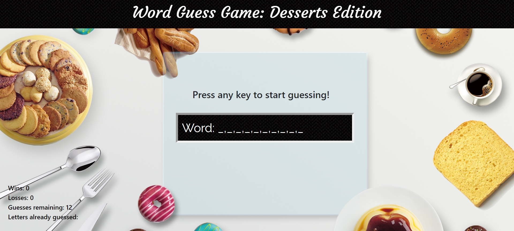

# Word-Guess-Game

This is essentially a hangman game created from scratch with HTML, CSS, and vanilla JavaScript.

To play, press any letter on the keyboard.
* The player has 12 lives per game.
* Each key pressed will be registered as a guess and stored in the bottom left corner.
* For each incorrect guess, the number of guesses remaining will decrement.
* There is no penalty for non-alphabet keystrokes
* For correct guesses, the number of guesses remaining will not decrement.
* The game will automatically reset for each win/loss.

This is not coded to support different display sizes. May appear differently on different displays.
My browser width is 1296px.
